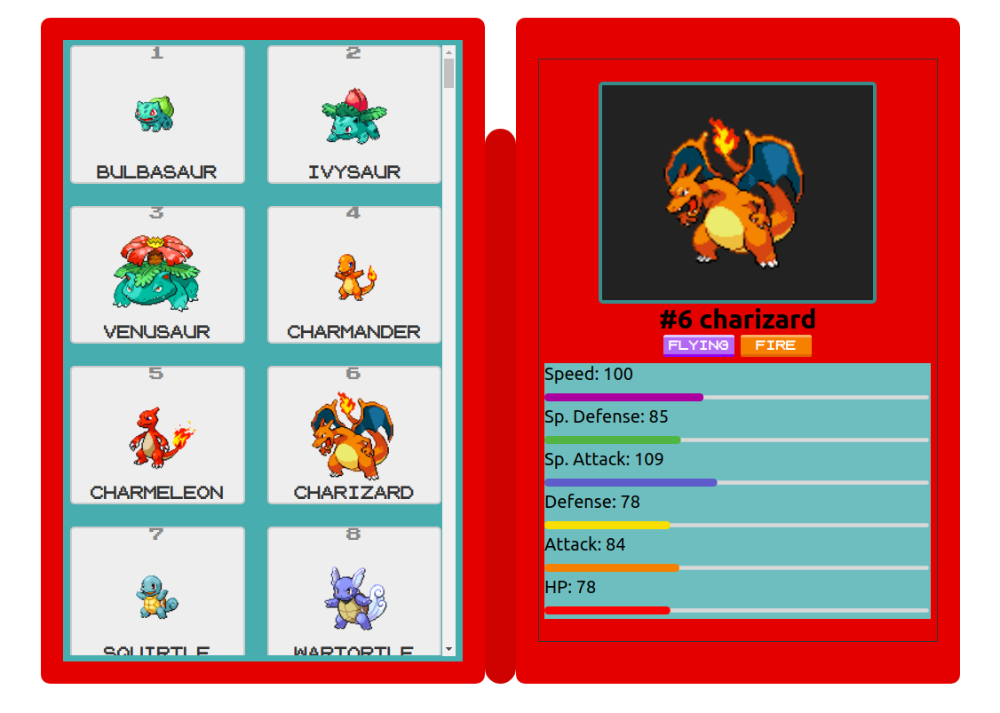

# Virtual Pokedex

A virtual version of our original pokedex built with React.



## How to Run

### 1. Clone it!

  ```git clone https://github.com/davim5/Pokedex-React-Virtual.git```

### 2. Go to the right directory!

  ```cd Pokedex-React-Virtual```

### 3. Install Dependencies!

  ```yarn```

### 4. Run it!

  ```yarn start```

### 5. Enjoy!

Runs the app in the development mode.<br />
Open [http://localhost:3000](http://localhost:3000) to view it in the browser.

<a href="https://www.buymeacoffee.com/davil5" target="_blank"></a>
